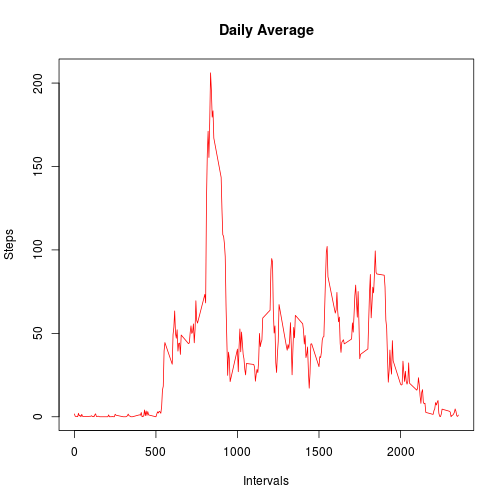
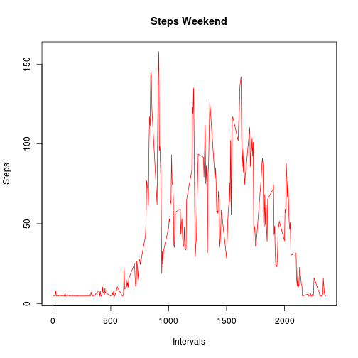
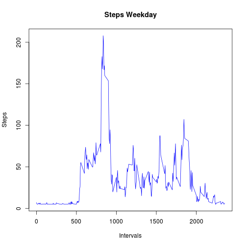

# Reproducible Research: Peer Assessment 1

This is the first peer assessment in Reproducible Research Coursera Course.

In this assessment will be tried to make a report answer some questions.

## Loading and preprocessing the data

First of all it will be load the data file in a data frame.


```r
data <- read.csv("activity.csv")
summary(data)
```

```
##      steps               date          interval   
##  Min.   :  0.0   2012-10-01:  288   Min.   :   0  
##  1st Qu.:  0.0   2012-10-02:  288   1st Qu.: 589  
##  Median :  0.0   2012-10-03:  288   Median :1178  
##  Mean   : 37.4   2012-10-04:  288   Mean   :1178  
##  3rd Qu.: 12.0   2012-10-05:  288   3rd Qu.:1766  
##  Max.   :806.0   2012-10-06:  288   Max.   :2355  
##  NA's   :2304    (Other)   :15840
```


## What is mean total number of steps taken per day?

In the first question, it will be made a histogram and reported the mean and median total number of step per day.

Let's calculate the total steps per day and create a new data frame.


```r
steps_day <- tapply(data$steps, data$date, sum, na.rm = TRUE)
```


Histogram of total steps per day. 


```r
hist(steps_day, main = "Histogram of total Steps per day", xlab = "Steps")
```

 


It will be calculated the mean and the median and reported.


```r
steps_mean <- mean(steps_day)
steps_median <- median(steps_day)
```


Mean: 9354.2295

Median: 10395

## What is the average daily activity pattern?

Calculate the average daily each interval and plot.


```r
steps_interval <- tapply(data$steps, data$interval, mean, na.rm = TRUE)
# plot
plot(names(steps_interval), steps_interval, main = "Daily Average", xlab = "Intervals", 
    col = "red", type = "l", ylab = "Steps")
```

 


It will be calculated and reported the interval with max average:


```r
steps_interval[which.max(steps_interval)]
```

```
##   835 
## 206.2
```


## Imputing missing values

Count the NA in dataset.


```r
length(data$steps[is.na(data$steps)])
```

```
## [1] 2304
```

```r
# or: length(subset(data$steps, is.na(data$steps)))
```


Now it will be created a new dataset and used the above mean *steps_interval* of each interval for the NA values.And present the plot


```r
newdata <- data
newdata$steps[is.na(newdata$steps)] <- mean(steps_interval)
newsteps_day <- tapply(newdata$steps, newdata$date, sum, na.rm = TRUE)
```


New histogram, mean and media:


```r
hist(newsteps_day)
```

 

```r
newsteps_mean <- mean(newsteps_day)
newsteps_median <- median(newsteps_day)
```


Mean: 1.0766 &times; 10<sup>4</sup>

Median: 1.0766 &times; 10<sup>4</sup>

## Are there differences in activity patterns between weekdays and weekends?

It will be caculated weekday for all days, calculated the interval mean by weekdays and weekends and ploted separated.


```r
# Locale to English needed for week names.
Sys.setlocale(category = "LC_ALL", locale = "C")
```

```
## [1] "LC_CTYPE=C;LC_NUMERIC=C;LC_TIME=C;LC_COLLATE=C;LC_MONETARY=C;LC_MESSAGES=es_ES.UTF-8;LC_PAPER=es_ES.UTF-8;LC_NAME=C;LC_ADDRESS=C;LC_TELEPHONE=C;LC_MEASUREMENT=es_ES.UTF-8;LC_IDENTIFICATION=C"
```

```r
newdata$rdate <- strptime(newdata$date, "%Y-%m-%d")
newdata$wde <- weekdays(newdata$rdate, abbreviate = TRUE) %in% c("Sat", "Sun")
newdata_wend <- newdata[newdata$wde, ]
newdata_wday <- newdata[newdata$wde == FALSE, ]

steps_wend <- tapply(newdata_wend$steps, newdata_wend$interval, mean, na.rm = TRUE)
steps_wday <- tapply(newdata_wday$steps, newdata_wday$interval, mean, na.rm = TRUE)
par(mcol = c(2, 1))
```

```
## Warning: "mcol" is not a graphical parameter
```

```r
plot(names(steps_wend), steps_wend, main = "Steps Weekend", xlab = "Intervals", 
    col = "red", type = "l", ylab = "Steps")
```

 

```r
plot(names(steps_wday), steps_wday, main = "Steps Weekday", xlab = "Intervals", 
    col = "blue", type = "l", ylab = "Steps")
```

 

